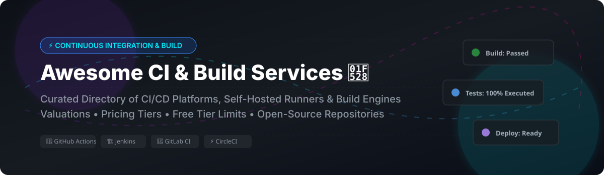

# Awesome-Continuous-Integration-Build-Service

# Awesome-Continuous-Integration-Build-Service 🔨 ⚡



  





  
  
  
  
  
  



---

## 🌟 Top Continuous Integration & Build Service Ecosystem

**Curated List of Commercial CI Platforms & Open-Source Build Automation Tools**  
*Focused on Build Automation, Test Execution, Artifact Management, Pipeline as Code, Caching & Self-Hosted CI Runners*

**Last updated: October 2026** 📅

---

### 📌 Overview & SEO Summary
Welcome to the ultimate curated directory of **continuous integration platforms**, **open-source build automation tools**, and **self-hosted CI runners**. Whether you are looking for enterprise-grade commercial solutions (such as *GitHub Actions*, *CircleCI*, and *Buildkite*), or self-hostable open-source alternatives (like *Jenkins*, *Drone CI*, and *Woodpecker CI*), this list covers category leaders, build caching, and privacy-respecting pipeline execution.

**Key Market Context:**
- **GitHub Actions** dominates CI with **20,000+ marketplace actions** and **free minutes for public repos**.
- **Jenkins** remains the **most widely deployed open-source CI server** with **25K+ GitHub stars** and **1,800+ plugins**.
- **Woodpecker CI** is the **community fork of Drone CI** after Harness restricted Drone's open-source license, with **5K+ GitHub stars** and **Docker-native pipelines**.

---

## 📑 Table of Contents
- [🏢 SaaS & Commercial Platforms](#-saas--commercial-platforms)
- [🔓 Open-Source GitHub Projects](#-open-source-github-projects)
- [🛠️ How to Contribute](#%EF%B8%8F-how-to-contribute)
- [📊 Star History](#-star-history)
- [🤝 Support & Sponsorship](#-support--sponsorship)
- [⚠️ Disclaimer](#%EF%B8%8F-disclaimer)

---

## 🏢 SaaS / Commercial Platforms

The continuous integration market spans **integrated CI/CD platforms** (GitHub Actions, GitLab CI/CD, Bitbucket Pipelines) that provide **source control and pipeline execution in one platform**, **specialized CI services** (CircleCI, Travis CI, Semaphore) that focus on **build speed and parallelism**, and **hybrid CI platforms** (Buildkite) that run **pipelines on your own infrastructure**. **GitHub Actions** is **free for public repos** with **2,000 CI/CD minutes/month for private** . **GitLab CI/CD** offers **400 CI/CD minutes/month free** with **Premium from $29/user/month** . **CircleCI** offers **30,000 credits/month free** with **Performance at $15/month** . **Bitbucket Pipelines** offers **50 build minutes/month free** with **Premium at $3/user/month** . **Buildkite** charges **$15/user/month** with **free for 3 users, 5 agents** . **AWS CodeBuild** charges **$0.005/build-minute for standard instances** .

| SaaS / Commercial Platform | Company / Owner | Valuation / Market Cap | Standard Edition Starting Price | Free Tier / Free Trial Limits | Description |
| :--- | :--- | :--- | :--- | :--- | :--- |
| **[AWS CodeBuild](https://aws.amazon.com/codebuild/)** ☁️ | Amazon | ~$2.0 Trillion | **$0.005/build-minute** (standard) | **Free tier: 100 build-minutes/month for 12 months**  | **AWS-native build service** — **Fully managed build service** that compiles source code, runs tests, and produces deployable artifacts . **Scales automatically** — no build servers to manage . **Pay only for build minutes consumed** . **Integrates with CodePipeline, S3, and IAM** . |
| **[GitHub Actions](https://github.com/features/actions)** 🐙 | Microsoft / GitHub | ~$3.90 Trillion | **Free for public repos**; **usage-based for private**  | **Free: 2,000 CI/CD minutes/month for private repos**  | **GitHub-native CI/CD** — **20,000+ marketplace actions** . **Matrix builds, reusable workflows, and OIDC authentication** . **Self-hosted runners** for custom environments . **The most widely adopted CI platform** — integrates seamlessly with GitHub repositories . |
| **[GitLab CI/CD](https://docs.gitlab.com/ee/ci/)** 🦊 | GitLab | ~$8 Billion | **Free: 400 CI/CD minutes/month**; **Premium: $29/user/month**  | **Free: 400 CI/CD minutes/month, 5 GB storage**  | **All-in-one DevOps platform** — **CI/CD, source control, and deployment** in a single platform . **Auto DevOps** for zero-config pipelines . **Review Apps** for ephemeral environments . **The most complete DevOps platform** . |
| **[CircleCI](https://circleci.com/)** ⚡ | CircleCI | Private | **Performance: $15/month** (30,000 credits)  | **Free: 30,000 credits/month, 5 active users**  | **Cloud-native CI/CD** — **Credit-based pricing for compute** . **30 concurrent Docker jobs** on free tier . **macOS and GPU support available** . **Overage rates $0.10–$0.50+ per build minute** . |
| **[Bitbucket Pipelines](https://bitbucket.org/product/features/pipelines)** 🔵 | Atlassian | ~$50 Billion | **Premium: $3/user/month**; **Standard: $2.50/user/month**  | **Free: 50 build minutes/month**  | **Atlassian-native CI/CD** — **Integrated with Bitbucket repositories** . **Docker-based pipelines** . **Simple YAML configuration** . **Best for teams already in the Atlassian ecosystem** . |
| **[Travis CI](https://travis-ci.com/)** 🟢 | Travis CI (Idera) | Private | **$69/month** (starting)  | **Free tier for open-source**  | **The original hosted CI** — **GitHub integration** . **Simple YAML configuration** . **Used by many open-source projects** . |
| **[Jenkins X](https://jenkins-x.io/)** ☁️ | Jenkins X | N/A (Open Source) | **Free** (self-hosted) | **Open-source free forever**  | **Cloud-native CI/CD for Kubernetes** — **Automated CI+CD with Preview Environments** on pull requests . **Built on Tekton and Prow** . **GitOps-first approach** with automated promotion across environments . |
| **[TeamCity Cloud](https://www.jetbrains.com/teamcity/cloud/)** 🧠 | JetBrains | Private | **$45/month** (starting)  | **Free: 3 build agents, 100 build configurations**  | **Powerful CI/CD** — **Kotlin DSL for pipeline-as-code** . **Test intelligence and parallel builds** . **The most configurable CI/CD platform** . |
| **[Buildkite](https://buildkite.com/)** 🔷 | Buildkite | Private | **$15/user/month** (starting)  | **Free: 3 users, 5 agents**  | **Hybrid CI/CD** — **Runs pipelines on your own infrastructure** . **Scalable and secure** — no code leaves your environment . **The most flexible CI/CD platform** . |
| **[Semaphore](https://semaphoreci.com/)** 🚦 | Semaphore | Private | **$29/month** (starting)  | **Free: 1,300 build minutes/month**  | **Fast CI/CD** — **Native Docker support** . **Automatic caching** . **Simple YAML configuration** . **The fastest hosted CI for small teams** . |

---

## 🔓 Open-Source GitHub Projects

*Sorted by GitHub_Stars_Count (Descending)* 🌟

- **[Jenkins](https://github.com/jenkinsci/jenkins)**   
  **The most widely adopted automation server**, MIT licensed. **25,184 GitHub stars** — **the original CI/CD platform** . **1,800+ plugins** for build, deploy, and automate . **Pipeline-as-code** with declarative and scripted syntax . **Self-hosted, extensible, and battle-tested** for over 15 years . **The foundation of modern CI/CD** — used by millions of developers worldwide . 🏛️

- **[Woodpecker CI](https://github.com/woodpecker-ci/woodpecker)**   
  **Community fork of Drone CI**, Apache-2.0 licensed. **The simplest Docker-native CI** — **pipelines are defined in `.woodpecker.yml`** . **Runs on Docker, Kubernetes, or directly on the host** . **Lightweight and fast** — **no database required for SQLite mode** . **The most accessible open-source CI for small teams** . 🪶

- **[Drone CI](https://github.com/drone/drone)**   
  **Container-native CI/CD platform**, Apache-2.0 licensed (core). **The original Docker-native CI** — **pipelines as code** in `.drone.yml` . **Runs on Docker, Kubernetes, or SSH** . **Harness acquired Drone** and restricted the open-source license, leading to the **Woodpecker CI fork** . **Still widely used but development has slowed** . 🐝

- **[Tekton](https://github.com/tektoncd/pipeline)**   
  **Kubernetes-native CI/CD framework**, Apache-2.0 licensed. **CNCF Incubating project** . **Build, test, and deploy across cloud providers and on-premises systems** . **Standardized building blocks for pipeline automation** . **Dashboard (960 stars), CLI (461 stars), and Pipelines-as-Code (217 stars)** available . 🔧

- **[Dagger](https://github.com/dagger/dagger)**   
  **Programmable CI/CD engine with container-native pipelines**, Apache-2.0 licensed. **13,775 GitHub stars** . **Write pipelines in Go, Python, TypeScript, or any language** . **Runs everywhere** — locally, in CI, or in Kubernetes . **Composable workflows for AI agents and CI/CD** . 🗡️

- **[Concourse](https://github.com/concourse/concourse)**   
  **Container-based automation system**, Apache-2.0 licensed. **Written in Go** . **Opinionated about idempotency, immutability, and declarative config** . **Built for reproducible builds and stateless workers** . **Active development toward v10** with multi-branch workflow improvements . 🏭

- **[GoCD](https://github.com/gocd/gocd)**   
  **Continuous delivery server by ThoughtWorks**, Apache-2.0 licensed. **7,114 GitHub stars** . **Value stream mapping, parallel execution, and dependency management** . **Designed for complex delivery pipelines** with visual feedback . **Pipeline-as-code support** . 🗺️

- **[Jenkins X](https://github.com/jenkins-x/jx)**   
  **Cloud-native CI/CD for Kubernetes**, Apache-2.0 licensed. **4,691 GitHub stars** . **Automated CI+CD with Preview Environments** on pull requests . **Built on Tekton and Prow** . **GitOps-first approach** with automated promotion across environments . ☁️

- **[Argo Workflows](https://github.com/argoproj/argo-workflows)**   
  **Container-native workflow engine for Kubernetes**, Apache-2.0 licensed. **CNCF Graduated project** . **DAG and step-based workflows** . **The standard for Kubernetes-native CI pipelines** . 🎯

---

## 🛠️ How to Contribute

Contributions are welcome! Follow these steps to submit new CI platforms or open-source build automation software:

1. 🍴 **Fork** the repository.
2. 📝 **Add/edit** entries in `README.md` maintaining table/list structure and formatting.
3. 🔗 Include project title, official website/GitHub link, exact Stars_Count, license, and brief description.
4. 🚀 Submit a **Pull Request** with a descriptive summary of your changes.

---

## 📊 Star History



---

## 🤝 Support & Sponsorship

If you find this continuous integration repository useful, please consider supporting the project:

- ⭐ **Star** this repository to increase visibility!
- 🔀 **Fork** and share with fellow DevOps engineers, platform teams, and open-source advocates.
- ☕ **Sponsor & Buy Me a Coffee**: Support ongoing open-source curation via the [GitHub Sponsor Dashboard](https://github.com/sponsors/ishandutta2007).

---

## ⚠️ Disclaimer

- This is a **community-curated** list — not exhaustive and not an endorsement. ℹ️
- **GitHub Actions and GitLab CI/CD are free for public repos** with **monthly minute limits for private** . **Jenkins is the most widely deployed open-source CI** with **25K+ GitHub stars** and **1,800+ plugins** .
- **Woodpecker CI is the community fork of Drone CI** after Harness restricted Drone's open-source license . **Drone CI is still widely used but development has slowed** .
- **Open-source CI tools are not turnkey** — they require **infrastructure, configuration, and ongoing maintenance** . **Jenkins requires plugin management and security hardening** . **Woodpecker requires Docker deployment** . **Always validate build pipelines with a proof-of-concept** before production deployment . 🔨

---



  <b>Made with ❤️ for DevOps engineers, platform teams, and open-source CI advocates.</b>

